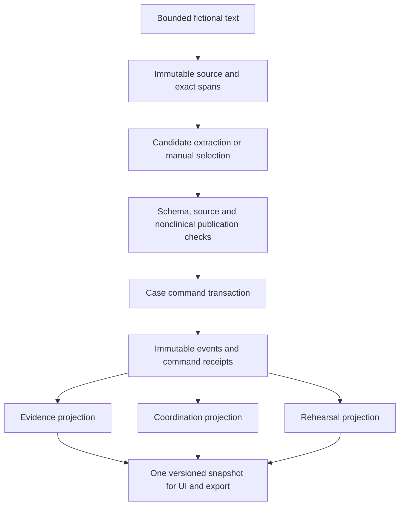

# System specification — contract 0.1.0

Status: specified, not implemented. The [Day 3 audit](day03-audit.md) accepts the 13 existing test outcomes while rejecting broader claims those tests do not support. The normative starting point is the [Day 1 contract](../day01/scope-and-acceptance.md). The [machine-readable registry](../../contracts/day04/contract.json), [API contract](api-contract.md) and [state rules](state-and-invariants.md) define the Day 4 design. The registry is a project inventory with a small type notation; it is not an OpenAPI document, runtime validator or deployed interface.

## Scope and architecture

Use one original fictional English plain-text case per session. UTF-8 Markdown may be stored as literal text, with no Markdown execution/rendering. All PDFs are unsupported until faithful extraction and visual anchoring are independently demonstrated. No live model behavior was exercised by Day 3. Initial reviewed fields and rehearsal choices are deterministic; a later model adapter may propose candidates but cannot publish facts, tasks, state or events. Text never initiates tool calls or external actions (FR-01, FR-04, FR-08, FR-11; INV-09, INV-11).

Modules and ownership for later implementation: ingestion owns byte limits/decoding/source snapshots; provenance owns exact slicing; review owns bounded categories and unresolved/conflicted evidence; command service owns actor authorization, version checks, idempotency and transactions; projection code owns current views; presentation owns readable source inspection and mode labels. The model adapter has no command-service credentials or mutation interface. A failure in candidate generation leaves the immutable source inspectable and publishes no fabricated success.

## Identity, versions and relationships

All IDs are server-issued opaque strings of 1–64 ASCII letters, digits, `_` or `-`; they carry no personal meaning. Every resource and join is scoped to `case_id`. Every reference to an actor must resolve to that case. Referencing another case returns not-found without revealing its existence. The actor comes from a server-validated session, not a submitted display name. Role switching is a labeled local simulation until real independently authenticated contexts pass service tests.

Three different version concepts are required:

| Token | Meaning | Mutation rule |
| --- | --- | --- |
| `source_version` | Identity of one exact immutable source snapshot | New text creates a new document ID/version; an old ID is never reused |
| `task_revision`, `instruction_revision`, `item_revision` | Identity of the immutable facts/dependencies acknowledged | Changed dependency creates a new entity ID and revision; old URI remains historical |
| `Case.state_version` | Monotonic integer identifying the whole committed case view | Every accepted existing-case mutation increments once; a retry increments zero times |

An immutable `CoordinationTask` row has its own unique ID and revision. The next version is a new row; `prior_task_revision` links its history. The same convention applies to reviewed instructions and rehearsal items. An owner change creates an event/projection update and changes the case version, without rewriting source dependencies. No old event is relabeled with a new source or task revision.

The registry defines 19 records. Important cardinalities and integrity constraints:

| Parent | Child/reference | Required integrity |
| --- | --- | --- |
| Case | Actors, sources, events, receipts, projections | Every child belongs to exactly one case; all joins enforce that case |
| SourceDocument | SourceSpan | At least one accepted span per published field; immutable digest/version must match |
| Instruction | InstructionField | 1–32 fields per review request; unique allowed field names per instruction |
| InstructionField | SourceSpan | Exactly one exact span; `value == exact_quote` in this initial contract |
| Task / acknowledgement / rehearsal | Dependency | Nonempty recorded source lineage for source-dependent entities |
| RevisionLink | Old and new SourceDocument | Two distinct existing versions in same case, acyclic and one accepted successor per prior version |
| TaskEvent | Actor and resource revision | Actor validated at commit; payload immutable; `(case_id, case_sequence)` unique |
| Acknowledgement | Task and TaskEvent | Exact task revision and dependency set retained; current validity is a projection |
| RehearsalAttempt | Item and TaskEvent | Choice belongs to the exact item revision; null choice means UNCLEAR |
| CommandReceipt | Actor, command fingerprint, committed events | `(case_id, actor_id, idempotency_key)` unique |

`EvidenceIssue` is immutable. The initial implementation has no generic “resolve issue” operation: an unresolved issue remains until new attributable source information is reviewed under an explicit relationship; a future resolution command needs its own contract and tests. This deliberate limit means some cases remain blocked. Acknowledging or completing a clarification task never changes an issue.

## Exact text and field publication

Store exactly the decoded UTF-8 text supplied after JSON parsing; compute SHA-256 over that text encoded to UTF-8. This is a digest of submitted source text, not of the JSON envelope or a pre-upload file. Preserve newlines, spaces, punctuation and Unicode normalization form. Reject invalid Unicode scalar sequences, NUL, unsupported media type, PDF/image signatures and oversized input. Do not normalize CRLF to LF after capture. An integrity check compares digest and actual length whenever the source is used for publication.

Offsets are zero-based Unicode scalar positions, `[start_char, end_char)`. Enforce `0 <= start < end <= len(text)` and exact substring equality, with the correct document and source version. JavaScript clients must not treat UTF-16 code units as these offsets; server-provided quotes and offsets are authoritative. Line/column are derived presentation aids using LF boundaries (one-based); page metadata is absent for plain text. A future PDF page anchor must never be invented as `page_index = 0`.

`review_source` accepts bounded explicit span selections, not a model's final `value`. The server derives `value` from the verified quote. Allowed field names are `appointment_wording`, `office_contact_wording`, `medication_wording`, `other_wording`, matching the category. The supported synthetic pattern requires an entire labeled line starting exactly `Follow-up appointment:` or `Office contact:` with a nonempty suffix. Its presence is textual evidence only. Arbitrary text, ambiguous labels or overlapping incompatible categories stays OTHER_QUOTE/read-only or UNRESOLVED. Human review of a label cannot certify clinical truth. Medication quotations and OTHER_QUOTE never become tasks or rehearsal items.

The initial structured case permits one reviewed appointment line and one reviewed office-contact line per active document. Multiple competing appointment values across unlinked sources produce CONFLICTED; missing required wording produces UNRESOLVED. The service recomputes these states from its records across the case; it never trusts an incoming `state`, `assigned_to`, `status`, `actor`, `value` or clinical/nonclinical classification. No generalized semantic entailment or arbitrary discharge parser is promised.

For initial actionable eligibility, an appointment suffix must exactly match an English weekday followed by ` at HH:MM` (00:00–23:59), with an optional final period. Preserve that literal text; do not infer a calendar date or timezone. The initial office-contact control is exactly `Office contact: fictional office desk.` Other office wording remains read-only until its grammar is explicitly extended and tested. A label such as `Follow-up appointment:` alone cannot convert embedded treatment text into an eligible appointment. Medication text mislabeled as an appointment fails the bounded grammar; prefix matching by itself is insufficient. This is a narrow authored-format contract and does not establish extraction coverage on arbitrary documents.

Creating a new source immediately suspends actionable coordination until source relationship and review are accounted for. The conservative gate considers every new source potentially relevant. Read-only source inspection and neutral clarification preparation remain possible. No upload time decides authority, and no hidden model merge clears a conflict.

## Tasks, rehearsal and labels

The service owns descriptions and templates. `ARRANGE_TRANSPORT` requires a currently supported appointment quotation. `LOCATE_OFFICE_CONTACT` requires a supported office-contact quotation. `PREPARE_CLARIFICATION` requires one or more actual unresolved issues and uses “Prepare a question to clarify these source details,” with their citations. It must not choose an appointment, prescribe a treatment or send an external message. No arbitrary task-description or completion-note request is accepted. A task label is nonclinical, but the associated source text is still untrusted and cannot authorize treatment (FR-03, FR-04; INV-08, INV-09).

Ownership is self-confirmation by the authenticated actor. Acknowledgement is a separate personal reviewed-wording event. Only the current assigned actor can complete the supported task. Neither acknowledgement nor completion resolves evidence. A changed task requires a new reviewed task entity and explicit ownership reconfirmation. Rehearsal is optional fixed source-choice practice, only for supported appointment/contact wording; MATCH means agreement with the quote, not verified comprehension. MISMATCH and UNCLEAR never become a pass. Choices do not generate advice.

All screens expose evidence state, coordination status, source/task revision, stale/current validity and rehearsal separately. Use visible `ROLE_SIMULATION`, `REPLAY`, unavailable and offline snapshot wording. Export carries the same labels. Keyboard source panels return focus; 320 CSS-pixel layouts stack quotations without obscuring source IDs or states. These remain future tests in the Day 2 criteria (FR-09, FR-10, FR-12; INV-02, INV-10).

## Persistence and implementation cuts

The required behavior is one transaction per case command: authenticate/authorize within the transaction's effective state, resolve references, deduplicate, compare versions, enforce evidence gates, append events/receipt and update projections. Readers see a complete committed snapshot. Replacement and simultaneous writes serialize on the same case row/version. Exceptions roll back all rows; a process crash cannot leave an accepted receipt without its event. Deep immutable payload storage and defensive copies replace Day 3's exposed dictionaries.

The master plan's relational-store architecture remains the target. No database engine, driver or deployment version is locked in this specification. A local SQLite prototype is acceptable only as an explicitly limited later adapter with the same transaction and independent-context tests; it cannot prove a PostgreSQL deployment. Dependency compatibility, live model access and persistent concurrency remain unverified. No new package installation is necessary for Day 4.

Initial invalidation is disclosed DOCUMENT_WIDE for all dependencies on an explicitly replaced document, including unchanged office text. This sacrifices precision to preserve integrity. A later exact unchanged mapping requires stored old/new spans, deterministic equality and reviewed correspondence; it must preserve the original acknowledgement revision rather than forge an acknowledgement of new wording. The current registry names that future policy but no endpoint accepts it yet. Every case displays “Whole-document re-review required” under the initial policy (FR-05, FR-06; INV-04–06).

Reset deletes case-bound sources, events, receipts, projections and evaluations and revokes all credentials. Append-only history applies during a live case; it does not defeat explicit deletion. Any future persistence must prove restart, crash recovery and reset behavior before shared-state claims. See [security](security-and-boundaries.md), [red tests](red-test-plan.md) and [ADR-003](../decisions/ADR-003-system-contract.md).
